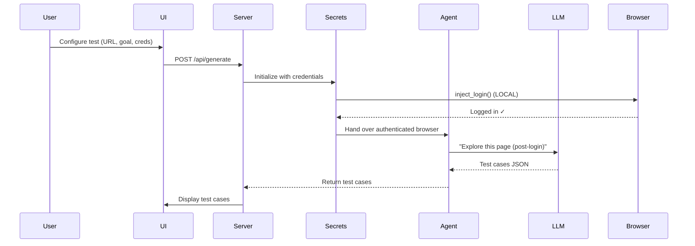
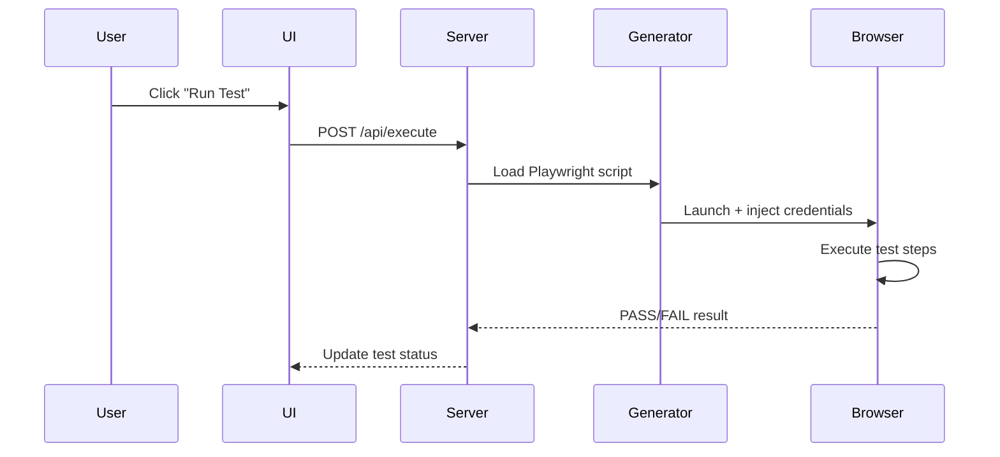

# 🤖 AI-Powered Testing Agent
### Autonomous Web Test Generation with Zero-Trust Security

[](https://www.python.org/downloads/)
[](https://fastapi.tiangolo.com/)
[](https://playwright.dev/)
[](LICENSE)

---

## 📖 Overview

An **AI-powered autonomous testing platform** that uses Large Language Models (LLMs) to explore web applications, generate test cases, and execute Playwright scripts—all while maintaining a **Zero-Trust Security Architecture** where credentials never reach the AI.

### 🎯 Key Features

- **🔍 AI-Driven Exploration**: Browser-Use Agent autonomously navigates your web app
- **🔐 Zero-Trust Security**: Credentials injected locally via Playwright, never sent to LLM
- **🖥️ Audit Dashboard**: Web-based interface to prove credentials never leak to AI (NEW!)
- **⚡ Auto-Generated Scripts**: Creates executable Playwright test scripts with selectors
- **🎭 Headless/Headed Modes**: Watch the agent work or run tests in background
- **📊 Session Caching**: Smart session management to skip redundant logins
- **🔁 Multi-LLM Support**: Works with Gemini 2.0, GPT-4, Claude 3.5, or local models
- **📈 Real-Time Monitoring**: Track LLM interactions and detect leaks live

---

## 🎥 Demo Videos

### 🕵️ Exploratory Agent in Action
Watch the AI agent autonomously explore the SauceDemo application and intelligently generate test cases:

https://github.com/user-attachments/assets/YOUR_VIDEO_ID_HERE

<details>
<summary>📹 Alternative: Direct Video Embed</summary>


*Note: If video doesn't play above, download it from the `demo/` folder*
</details>

### ✅ Automated Test Execution
See the generated Playwright scripts execute with real browser automation:

https://github.com/user-attachments/assets/YOUR_VIDEO_ID_HERE

<details>
<summary>📹 Alternative: Direct Video Embed</summary>


*Note: If video doesn't play above, download it from the `demo/` folder*
</details>

---

## 🏗️ Architecture Overview

```
┌─────────────────────────────────────────────────────────────┐
│                      TRUST BOUNDARY                         │
├─────────────────────────────────────────────────────────────┤
│  LOCAL ZONE (Secure)          │    CLOUD ZONE (AI)          │
│                                │                            │
│  ┌──────────────────┐         │         ┌─────────────┐    │
│  │   .env File      │         │         │  LLM API    │    │
│  │  ┌────────────┐  │         │         │  (Gemini/   │    │
│  │  │ USERNAME   │  │         │         │   Claude)   │    │
│  │  └────────────┘  │         │         └─────────────┘    │
│  └────────┬─────────┘         │               ▲            │
│           │                   │               │            │
│  ┌──────────────────┐         │         ONLY SEES:         │
│  │ SecretsManager   │         │      ┌──────────────┐      │
│  │  inject_login()  │─────────┼─────▶│ Post-login   │      │
│  └────────┬─────────┘         │      │ Page State   │      │
│           │                   │      │              │      │
│  Page is now logged in        │      │ "Welcome!"   │      │
│           │                   │      │ [Items...]   │      │
│           ▼                   │      └──────────────┘      │
│     ┌─────────────┐           │                            │
│     │  AI Agent   │───────────┼────────────────────────────│
│     └─────────────┘           │                            │
└─────────────────────────────────────────────────────────────┘
```

### 🔒 Security Guarantees

- ✅ **No Credentials in Prompts**: LLM never sees username/password
- ✅ **Local Injection**: Playwright fills login forms before AI involvement
- ✅ **Session Caching**: Cookies saved locally (never shared with AI)
- ✅ **Web Audit Dashboard**: Visual proof at `http://localhost:8000/audit`
- ✅ **Real-Time Leak Detection**: Scans every LLM request for credentials
- ✅ **Compliance Reports**: Auto-generated SOC2/ISO27001 documentation
- ✅ **Static Analysis**: Automated code verification in CI/CD
- ✅ **GDPR/SOC2/HIPAA Ready**: Enterprise-grade security architecture

---

## 🚀 Quick Start

### Prerequisites

- Python 3.12+
- Node.js 18+ (for Playwright browsers)
- API Key for Gemini/OpenAI/Claude (or local LLM setup)

### Installation

```bash
# Clone the repository
git clone https://github.com/yourusername/AI_Powered_Testing_Agent.git
cd AI_Powered_Testing_Agent

# Install dependencies
pip install -r requirements.txt

# Install Playwright browsers
playwright install chromium

# Configure environment
cp .env.example .env
# Edit .env with your API keys
```

### Configuration

Edit `.env` file:

```bash
# LLM Provider (options: gemini, openai, anthropic, custom)
LLM_PROVIDER=gemini

# API Keys (fill at least one)
GOOGLE_API_KEY=your_gemini_api_key_here
OPENAI_API_KEY=your_openai_key_here
ANTHROPIC_API_KEY=your_claude_key_here

# Optional: Default test credentials (can be overridden in UI)
APP_LOGIN_URL=https://www.saucedemo.com
APP_USERNAME=standard_user
APP_PASSWORD=secret_sauce
```

### Run the Server

```bash
# Start FastAPI server
python -m uvicorn src.core.server:app --reload --host 0.0.0.0 --port 8000
```

Open your browser: **http://localhost:8000**

---

## 📂 Project Structure

```
AI_Powered_Testing_Agent/
├── src/
│   ├── core/
│   │   ├── server.py              # FastAPI backend + audit endpoints
│   │   ├── secrets_manager.py     # 🔐 Zero-trust credential injection
│   │   └── config.py              # Configuration loader
│   ├── security/                  # 🔐 NEW: Security auditing
│   │   ├── audit_logger.py        # LLM request monitoring
│   │   └── __init__.py
│   ├── agents/
│   │   └── explorer_agent.py      # 🤖 AI exploration logic
│   ├── generators/
│   │   └── playwright_generator.py # 📝 Script generation
│   └── llm/
│       └── llm_factory.py         # 🧠 Multi-LLM support
├── templates/
│   ├── index.html                 # 🎨 Main web UI
│   └── audit_dashboard.html       # 🛡️ NEW: Security audit UI
├── scripts/
│   └── verify_credential_isolation.py # 🔬 Static code analysis
├── data/
│   ├── test_suites.json           # Generated test cases
│   ├── generated_tests/           # Playwright scripts
│   ├── auth_cache/                # Session cookies
│   ├── security_audit/            # 🔐 NEW: Audit logs & reports
│   └── audit_config.json          # 🔐 NEW: Audit settings
├── docs/
│   ├── ARCHITECTURE_GUIDE.md      # 📚 Deep dive documentation
│   ├── SECURITY_EXPLANATION.md    # 🛡️ Security model explained
│   ├── SECURITY_AUDIT_GUIDE.md    # 🔬 Audit verification guide
│   └── AUDIT_LOGGING_GUIDE.md     # 📖 Audit feature docs
├── demo/                          # 🎥 Demo videos
├── .env                           # 🔑 Secrets (git-ignored)
└── requirements.txt
```

**Key Directories**:
- `src/security/` - 🔐 **NEW**: Audit logging and leak detection
- `templates/audit_dashboard.html` - 🖥️ **NEW**: Security verification UI
- `scripts/` - 🔬 Static code analysis tools

---

## 🛡️ Security Audit Dashboard

### Visual Proof of Credential Safety

Access the audit dashboard at: **http://localhost:8000/audit**


### ✨ Features

| Feature | Description |
|---------|-------------|
| 🎚️ **Toggle Control** | Enable/disable audit logging with one click |
| 📊 **Real-Time Stats** | Total logs, compliance reports, leak count (should be 0!) |
| 🔍 **Live Log Viewer** | See every LLM request/response with timestamps |
| 📋 **Compliance Reports** | Auto-generated SOC2/ISO27001 documentation |
| 🎨 **Color-Coded Alerts** | Purple (request), Green (safe), Red (leak detected) |
| ⚡ **Auto-Refresh** | Updates every 10 seconds |

### 🚀 Quick Demo (30 seconds)

**Perfect for stakeholder presentations!**

1. **Enable Audit Logging**:
   ```
   Navigate to: http://localhost:8000/audit
   Toggle switch to ON (turns purple/green)
   ```

2. **Run a Test**:
   ```
   Return to: http://localhost:8000/
   Fill credentials and generate tests
   ```

3. **Show Visual Proof**:
   ```
   Return to: http://localhost:8000/audit
   Point to "Credential Leaks: 0" ✅ (in green)
   Click "View Report" for compliance docs
   ```

### 📈 What Gets Logged

Each audit entry contains:
- ⏰ **Timestamp**: When request was made
- 📝 **Prompt Preview**: First 300 chars of LLM prompt
- 🔐 **Leak Detection**: Automatic pattern matching
- #️⃣ **SHA-256 Hash**: Cryptographic verification
- ✅ **Safe/Danger Badge**: Visual indicator

**Example Log Entry:**
```json
{
  "timestamp": "2025-12-02T14:30:00Z",
  "type": "LLM_REQUEST",
  "prompt_length": 1247,
  "prompt_hash": "a3f2b8...",
  "leak_detected": false,  ← Should ALWAYS be false!
  "prompt_preview": "You are starting on an AUTHENTICATED session..."
}
```

### 🏢 Enterprise Benefits

- ✅ **POC Demonstrations**: Live visual proof for security teams
- ✅ **Compliance Audits**: Exportable logs + reports
- ✅ **Continuous Monitoring**: Track all LLM interactions
- ✅ **Zero Configuration**: Works out-of-the-box
- ✅ **Persistent Settings**: Survives server restarts

---

## 🎯 How It Works

### 1️⃣ **Test Generation Flow**



### 2️⃣ **Test Execution Flow**



---

## 🛠️ Usage Example

### Via Web UI

1. **Configure Test**:
   - Suite Name: "Smoke Test A"
   - URL: `https://www.saucedemo.com`
   - Username: `standard_user`
   - Password: `secret_sauce`
   - Goal: "Add item to cart, verify, remove, logout"

2. **Launch Agent**: AI explores and generates test cases

3. **Execute Tests**: Click "Run" to validate generated scripts

### Via API

```bash
# Generate test cases
curl -X POST http://localhost:8000/api/generate \
  -H "Content-Type: application/json" \
  -d '{
    "suite_name": "Smoke Test",
    "url": "https://www.saucedemo.com",
    "description": "Verify cart functionality",
    "username": "standard_user",
    "password": "secret_sauce",
    "headless": false
  }'

# Execute a test case
curl -X POST http://localhost:8000/api/execute \
  -H "Content-Type: application/json" \
  -d '{
    "suite_name": "Smoke Test",
    "test_case_id": "TC001"
  }'
```

---

## 🔧 Advanced Features

### 🎭 Headless Mode

Toggle between visible browser (for debugging) and background execution (for CI/CD):

```python
# In UI: Use the "Headless Mode" toggle
# In API:
{
  "headless": true  # Background execution
}
```

### 💾 Session Caching

First run performs login → saves cookies to `data/auth_cache/`
Subsequent runs load cached session → **~10 seconds faster!**

To clear cache:
```bash
rm -rf data/auth_cache/*
```

### 🧪 Custom LLM Models

Use local models like Ollama:

```bash
# In .env
LLM_PROVIDER=custom
CUSTOM_BASE_URL=http://localhost:11434/v1
CUSTOM_MODEL_NAME=llama2
```

---

## 📊 Technical Stack

| Layer | Technology | Purpose |
|-------|-----------|---------|
| **Frontend** | HTML5, TailwindCSS, Vanilla JS | Clean, responsive UI |
| **Backend** | FastAPI (Python) | Async API server |
| **AI Agent** | Browser-Use + LangChain | Autonomous browser control |
| **LLM** | Gemini 2.0 / GPT-4 / Claude | Test case reasoning |
| **Automation** | Playwright (Python) | Browser automation |
| **Security** | SecretsManager | Zero-trust credential handling |

---

## 🔐 Security Best Practices

1. **Never Commit `.env`**: Already in `.gitignore`
2. **Rotate API Keys**: Use environment-specific keys
3. **Review Generated Tests**: Validate before production use
4. **Session File Permissions**: `chmod 600 data/auth_cache/*`
5. **HTTPS in Production**: Use SSL for web UI

---

## 🤝 Contributing

Contributions welcome! Please:

1. Fork the repository
2. Create a feature branch: `git checkout -b feature/amazing-feature`
3. Commit changes: `git commit -m 'Add amazing feature'`
4. Push to branch: `git push origin feature/amazing-feature`
5. Open a Pull Request

---

## 📜 License

This project is licensed under the MIT License - see the [LICENSE](LICENSE) file for details.

---

## 🙏 Acknowledgments

- [Browser-Use](https://github.com/browser-use/browser-use) for AI browser automation
- [Playwright](https://playwright.dev/) for reliable browser testing
- [LangChain](https://langchain.com/) for LLM orchestration
- [FastAPI](https://fastapi.tiangolo.com/) for modern Python APIs

---

## 📞 Support

- 📚 [Architecture Guide](docs/ARCHITECTURE_GUIDE.md)
- 🐛 [Report Issues](https://github.com/yourusername/AI_Powered_Testing_Agent/issues)
- 💬 [Discussions](https://github.com/yourusername/AI_Powered_Testing_Agent/discussions)

---

**Built with ❤️ for QA Engineers who love automation**
