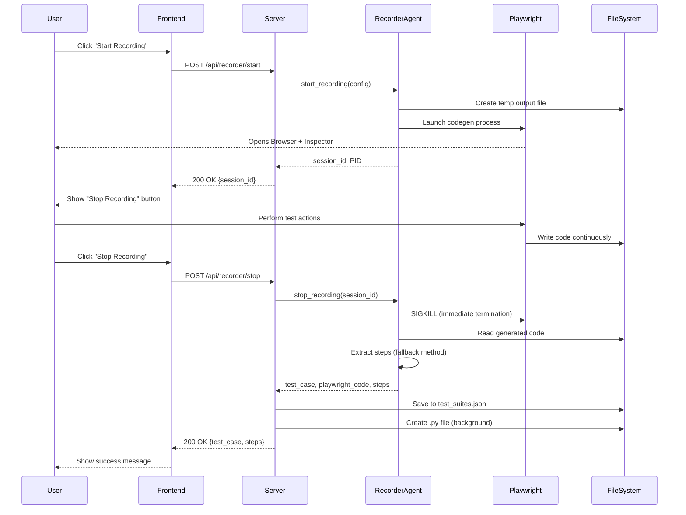

# Recording Flow Documentation

## Overview
The Playwright Recorder allows users to record browser interactions and automatically convert them into executable test cases with human-readable step descriptions.

## Architecture Flow



## Detailed Step-by-Step Process

### 1. Start Recording

**User Input:**
- Suite Name (e.g., "Checkout-Flow")
- Test Title (e.g., "Complete Purchase")
- Application URL (e.g., "https://www.saucedemo.com")
- Username (optional)
- Password (optional)
- Headless mode (boolean)

**Backend Process:**
1. Generate unique session ID (UUID)
2. Create temporary output file: `/tmp/playwright_recordings/recording_{session_id}.py`
3. Build Playwright command:
   ```bash
   playwright codegen -o <output_file> --target python-async --viewport-size 1280,720 <url>
   ```
4. Launch subprocess with `subprocess.Popen`
5. Store session metadata in memory:
   ```python
   session = {
       "config": {...},
       "process": <Popen object>,
       "output_file": "<path>",
       "started_at": "<ISO timestamp>"
   }
   ```

**What Opens:**
- Playwright Inspector window (controls/tools)
- Chrome browser window (for recording)

### 2. Recording Phase

**What Happens:**
- User interacts with the browser (clicks, types, navigates)
- Playwright captures every action in real-time
- Code is written **continuously** to the output file
- No data sent to server during this phase

**Actions Captured:**
- Navigation (`page.goto()`)
- Clicks (`page.locator().click()`)
- Text input (`page.locator().fill()`)
- Keyboard actions (`page.locator().press()`)
- Assertions (`expect().to_be_visible()`)
- Page close (`page.close()`)

### 3. Stop Recording

**Process Termination:**
1. Retrieve Playwright process from session
2. **Immediate SIGKILL** (no graceful shutdown - takes ~2 seconds)
   ```python
   process.kill()  # Instant termination
   process.communicate(timeout=2)
   ```
3. Read generated code from output file

**Generated Code Example:**
```python
import asyncio
from playwright.async_api import Playwright, async_playwright, expect

async def run(playwright: Playwright) -> None:
    browser = await playwright.chromium.launch(headless=False)
    context = await browser.new_context(viewport={"width":1280,"height":720})
    page = await context.new_page()
    await page.goto("https://www.saucedemo.com/")
    await page.locator("[data-test=\"username\"]").click()
    await page.locator("[data-test=\"username\"]").fill("standard_user")
    # ... more actions
```

### 4. Step Extraction (No LLM)

**Current Implementation: Fallback-Only Method**

> **Note:** LLM conversion was **disabled** due to reliability issues (hanging, timeouts). The fallback method provides fast, consistent results.

**Extraction Process:**
```python
def _extract_steps_from_code(self, playwright_code: str) -> list:
    steps = []
    lines = playwright_code.split('\n')
    
    for line in lines:
        line = line.strip()
        
        # Skip imports, comments, function definitions
        if not line or line.startswith('#') or line.startswith('import'):
            continue
            
        # Extract different action types
        if 'page.goto(' in line:
            url = extract_url(line)
            steps.append(f'Navigate to "{url}"')
            
        elif '.click()' in line:
            element = extract_element_id(line)
            steps.append(f'Click {element}')
            
        elif '.fill(' in line:
            element, value = extract_fill_details(line)
            steps.append(f'Enter "{value}" in {element} field')
            
        # ... more patterns
    
    return steps
```

**Supported Patterns:**
- `page.goto()` → "Navigate to {url}"
- `locator().click()` → "Click {element}"
- `locator().fill()` → "Enter {value} in {element} field"
- `get_by_role().click()` → "Click {role}"
- `expect().to_be_visible()` → "Verify element"
- `page.close()` → "Close page"

**Element ID Extraction:**
- From `data-test` attributes: `[data-test="username"]` → "username"
- From `id` attributes: `#login-button` → "login-button"
- From roles: `get_by_role("button", name="Submit")` → "Submit button"

### 5. Data Persistence

**Test Suite JSON Structure:**
```json
{
  "Suite-Name": {
    "config": {
      "suite_name": "Suite-Name",
      "test_title": "Test Title",
      "url": "https://example.com",
      "username": "",
      "password": "",
      "headless": false
    },
    "cases": [
      {
        "id": "TC001",
        "title": "Test Title",
        "steps": [
          "Navigate to \"https://example.com\"",
          "Click username",
          "Enter \"test_user\" in username field",
          "Click login-button"
        ],
        "playwright_code": "import asyncio...",
        "recorded_at": "2025-12-24T14:51:23.969222",
        "recording_session_id": "944a3dd7-4cac-4b30-a148-96060d3f2235"
      }
    ]
  }
}
```

**Generated Python File:**
Location: `data/generated_tests/{Suite-Name}_{TestID}_{title}.py`

Contents:
```python
"""
Test Case: TC001
Title: Checkout Flow
Suite: E2E-Tests
Recorded: 2025-12-24T14:51:23.969222

English Steps:
  1. Navigate to "https://www.saucedemo.com/"
  2. Click username field
  3. Enter "standard_user" in username field
  ...
"""

import asyncio
from playwright.async_api import Playwright, async_playwright, expect

async def run(playwright: Playwright) -> None:
    browser = await playwright.chromium.launch(headless=False, slow_mo=500)
    # ... generated code with slow_mo for visibility
```

**Note:** `slow_mo=500` is automatically added to add 500ms delay between actions for better visual feedback during execution.

## LLM Integration (Currently Disabled)

### Previous Implementation

**What Was Sent to LLM:**
```python
prompt = f"""Convert the following Playwright Python code into a list of simple English steps.

Code:
{playwright_code}

Return ONLY a JSON array of step descriptions.
Example: ["Navigate to login page", "Enter username", "Click submit"]
"""
```

**Why It Was Disabled:**
1. **Reliability Issues:** LLM calls would hang indefinitely (2.5+ minutes)
2. **Timeout Errors:** Frontend would timeout before LLM responded
3. **Fallback Works Better:** Deterministic, fast (~1 second), consistent results

**Fallback vs LLM Comparison:**

| Aspect | LLM Method | Fallback Method |
|--------|-----------|-----------------|
| **Speed** | 15-30 seconds (or timeout) | ~1 second |
| **Reliability** | Frequent hangs/errors | 100% consistent |
| **Cost** | API costs per request | Free |
| **Quality** | More natural language | Technical but clear |
| **Dependencies** | Requires API key | None |

### Future LLM Enhancement (Optional)

If LLM is re-enabled in the future, consider:

1. **Timeout Protection:** Set strict 10-second timeout on LLM calls
2. **Async Processing:** Don't block the main response
3. **Post-Processing:** Save test first, enhance with LLM in background
4. **Caching:** Cache common patterns to avoid repeated LLM calls

## Error Handling

**Common Issues:**

1. **Playwright Not Installed:**
   - Error: `playwright: command not found`
   - Fix: `pip install playwright && playwright install`

2. **Process Won't Terminate:**
   - Symptom: Timeout after 180 seconds
   - Cause: Playwright process not dying properly
   - Fixed: Using immediate SIGKILL instead of graceful termination

3. **Empty Recording:**
   - Symptom: Only captures `goto("about:blank")`
   - Cause: Browser closed too quickly after opening
   - Fix: Wait for browser to fully load, perform actions, then stop

4. **Duplicate Tests:**
   - Symptom: Same test saved multiple times
   - Fixed: Server checks for existing test ID before saving

## Performance Metrics

**Typical Timing:**
- Start recording: ~1-2 seconds
- Recording phase: User-controlled
- Stop recording: ~3-5 seconds
  - Process kill: ~2 seconds
  - File read: <1 second
  - Step extraction: ~1 second
  - Save to disk: <1 second

**Resource Usage:**
- Playwright process: ~100-200 MB RAM
- Output file: ~500 bytes - 5 KB (depending on test length)
- Session metadata: ~1 KB in memory

## Security Considerations

**Credentials Handling:**
- Username/password fields in the UI are optional
- **Not currently used** in the recording process
- **Not stored** in test_suites.json
- **Not sent** to any external services

**File System:**
- Temporary files: `/tmp/playwright_recordings/` (auto-cleaned system directory)
- Generated tests: `data/generated_tests/` (project directory)
- Test suites: `data/test_suites.json` (version controlled)

**Network:**
- Only Playwright connects to the target application
- No data sent to external LLM services (currently)
- All processing is local

## Logging & Debugging

**Log Locations:**
- Main server: Console output from uvicorn
- Recorder events: `src/agents/recorder_logger.py`

**Key Log Messages:**
```
🎬 RECORDING SESSION START: {session_id}
✅ Recording session started: {session_id} (PID: {pid})
⚡ Immediately killing Playwright process {pid}
✅ Process {pid} terminated successfully
📋 Extracting steps using fallback method
✅ Extracted {count} steps from code
💾 Saved test case {test_id} to suite '{suite_name}'
📄 Saved executable script to: {filepath}
```

## Troubleshooting Guide

1. **Modal stuck on "Processing..."**
   - **Cause:** Browser cache has old JavaScript
   - **Fix:** Hard refresh (Ctrl+Shift+R / Cmd+Shift+R)

2. **No Playwright window opens**
   - **Cause:** Display issues or process failed to start
   - **Check:** Look for Playwright process in system monitor
   - **Check:** Console logs for error messages

3. **Timeout errors**
   - **Cause:** Old code with slow termination (should be fixed)
   - **Verify:** Check for "⚡ Immediately killing" in logs
   - **Fix:** Ensure latest code is deployed

4. **Steps look technical/unclear**
   - **Expected:** Fallback method produces technical descriptions
   - **Example:** "Click username" instead of "Click the username input field"
   - **Note:** Trade-off for reliability and speed

---

**Last Updated:** December 24, 2025  
**Version:** 2.0 (Post-LLM-Removal)
